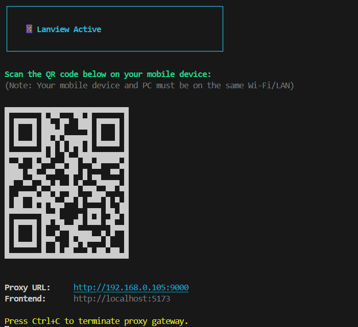

#  LanView CLI

An open-source, zero-config CLI utility built with Node.js that allows developers to instantly preview their full-stack web applications on mobile devices using only their local network (LAN). It eliminates the need for external cloud tunnels (like ngrok), third-party VMs, or manual IP configuration.

---

## 🛑 The Problem It Solves

When testing a web app on a physical mobile device, developers face two major friction points:

1. **Typing Long URLs:** Manually looking up your machine's local IP address and typing `http://192.168.1.45:3000` into a phone browser is tedious and annoying.
2. **The "Localhost" Backend Broken Link:** If your frontend code contains a reference to `http://localhost:5000/api` for backend requests, **it will fail on your phone**. This is because your phone interprets `localhost` as *itself*, not your computer. Changing your source code to hardcoded IPs every time you want to test on mobile is a terrible developer experience.

---

## The Solution: How It Works

**Lanview** creates a temporary, intelligent bridge on your machine. When run, it executes three core steps completely locally:

### 1. Auto-Discovery (Network Mapping)

The tool queries your operating system's network interfaces, filters out internal virtual addresses, and automatically extracts your computer's active LAN IPv4 address (e.g., `192.168.1.15`).

### 2. Micro Reverse Proxy Server

It spins up a lightweight, local HTTP proxy gateway on port `8080`. This gateway acts as a single point of traffic coordination:

* If a request is for static assets or the user interface, it forwards it to your **Frontend** (e.g., Vite/Next.js on port `3000`).
* If a request path starts with `/api`, it intercepts it and forwards it to your **Backend** (e.g., Node/Express/Python on port `5000`).

This completely eliminates CORS issues and allows you to use relative fetch paths (like `fetch('/api/data')`) seamlessly across both desktop and mobile.

### 3. QR Code Terminal Generation

The tool converts the consolidated gateway URL into a scannable QR Matrix and renders it directly inside the developer's terminal using ANSI text blocks.



---

## 🛠️ Key Technical Features

* **Zero Cloud Dependency:** 100% private and offline. Data never leaves your local Wi-Fi router. There are no data limits, third-party accounts, or external latency.
* **Relative-Path Routing:** Because both frontend and backend are multiplexed through a single local port (`8080`), developers don't have to alter a single line of environmental variables or configuration files.
* **Environment Agnostic:** Works with React, Vue, Svelte, Next.js, Vite, Express, Django, Laravel, or any other framework stack.
* **WebSocket HMR support:** Fully proxies WebSockets, keeping your Hot Module Replacement (HMR) connection active on mobile devices.

---

## 📋 Architectural Workflow

```
[ Mobile Phone ] (Connected to Wi-Fi)
       │
       │ (Scans QR -> Hits 192.168.1.XX:8080)
       ▼
  [ Lanview Proxy ] 
       │
       ├─── (Default Path / )   ───► [ Local Frontend Server ] (Port 3000)
       │
       └─── (Path is /api/* )   ───► [ Local Backend API ]    (Port 5000)
```

---

## 🚀 Getting Started

### Installation

#### Option A: From NPM (Once Published)
Install the package globally:
```bash
npm install -g lanview
```
Or run it directly with `npx`:
```bash
npx lanview
```

#### Option B: From Source (Local Development)
Since this package is in active development and yet to be published, you can install and run it from source:

1. **Clone the repository and install dependencies:**
   ```bash
   git clone https://github.com/your-username/lanview.git
   cd lanview
   npm install
   ```

2. **Link the CLI command globally:**
   ```bash
   npm link
   ```
   *(This creates a global symlink so the `lanview` command can be run from any folder on your machine).*

### Usage

Simply run:
```bash
lanview
```

By default, this will run a proxy gateway on port `8080` routing:
- `/api/*` to `http://localhost:5000`
- Everything else to `http://localhost:3000`

#### Customization

You can customize the ports and paths via CLI options:

```bash
lanview --frontend 4000 --backend 8000 --gateway 9000 --api-prefix /graphql
```

Options:
- `-f, --frontend <port>` - Port of the frontend server (default: `3000`)
- `-b, --backend <port>` - Port of the backend server (default: `5000`)
- `-g, --gateway <port>` - Port of the proxy gateway (default: `8080`)
- `-p, --api-prefix <path>` - URL prefix to forward to the backend (default: `/api`, `none` if no prefix)
- `-h, --host <ip>` - Manually specify your host IP instead of auto-discovery
- `--help` - Show help information
